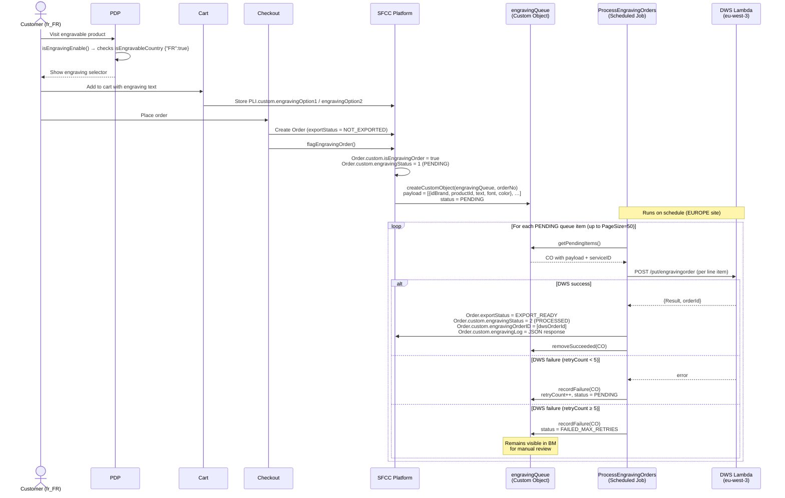

# TSD — Engraving on EUROPE (France)

## 1. Context & problem

Baccarat team requested the ability to personalise crystal products with custom engraved text in EUROPE. The feature exposes an engraving selector on eligible PDPs for the configured locales, stores the customer's text on the product line item, and—after order placement—transmits an engraving payload to an external DWS service (AWS Lambda, eu-west-3). The primary business driver is enabling the Baccarat operations team to correctly produce and track engraved items: DWS must receive exactly one notification per engraved unit before the order is released to fulfilment. Orders containing engraved products are held in `EXPORT_NOT_EXPORTED` state until DWS confirms receipt, at which point a scheduled job promotes them to `EXPORT_READY` and releases them to fulfilment. Engraved orders also follow a deferred-capture payment workflow (same as APAC): Adyen payment is captured only after shipment confirmation, not at placement. The rollout is intentionally scoped to France only; other EUROPE-site countries are excluded via site preference.

## 2. Goals & non-goals

**Goals**
- Surface the engraving UI (PDP selector, cart summary, checkout card) for `fr_FR` locale on the EUROPE site
- Support single (`engravingOption1`) and double (`engravingOption2`) engraving per eligible product
- Transmit engraving payloads to the DWS Lambda endpoint after order placement; send **exactly 1 DWS API call per engraved unit** (e.g. 1 SKU × 2 qty engraved = 2 separate calls)
- Hold order export until DWS confirmation; retry up to 5 times on transient failures (timeout, 500, DWS unavailable)
- Set DWS status to `FAILED` immediately on 400 (bad data) responses without retrying
- Set order DWS status to "DWS error" with detailed logs on permanent failure after max retries
- Provide BM visibility into DWS transmission status alongside engraving information on the order
- Provide BM visibility into queue failures (`FAILED_MAX_RETRIES` custom objects)
- Email a dedicated list when a DWS transmission reaches permanent failure
- Manual resend capability from BM, with duplicate-send prevention (skip if already successfully sent)
- Apply deferred payment capture for engraved orders: Adyen capture triggered only after shipment confirmation (same pattern as APAC)
- Apply "no mixed cart" condition: the deferred-capture workflow applies only when the order contains at least one engraved item (same pattern as APAC)
- Standard (immediate) payment workflow applies to non-engraved orders

**Non-goals**
- Engraving for other EUROPE-site countries (BE, NL, DE, …)
- Engraving on APAC or Japan sites
- Real-time engraving status push to the customer
- Font/colour selection by the customer (font and colour are hardcoded in the payload: `PALSCRI1.TTF` / `gold`)

## 3. Stakeholders

| Role | Name |
|---|---|
| Tech lead | Bruno Lopes |
| Product owner | — |
| QA | — |
| Client side | — |

## 4. Current state

Prior to this work the EUROPE site had no engraving capability. The `app_baccarat_neurope` cartridge contained no engraving overrides. The full engraving implementation (decorator, helpers, queue, job) already existed in the base `app_baccarat` and integration cartridges, gated by the `isEngravableCountry` site preference (which was empty or `{}` for EUROPE). The `releases/engraving_eu/` folder was created to hold all deployment artefacts.

## 5. Proposed design

### 5.1 Architecture summary



No changes were needed in the `app_baccarat_neurope` cartridge; all logic lives in the shared base cartridges and is activated exclusively through site preferences.

### 5.2 SFRA touchpoints

| Layer | File (cartridge-relative) | Change |
|---|---|---|
| Decorator | `app_baccarat/cartridge/models/product/decorators/engraving.js` | Pre-existing; no change |
| Helper | `app_baccarat/cartridge/scripts/helpers/engravingHelpers.js` | Pre-existing; no change |
| Controller | `app_baccarat/cartridge/controllers/Product.js` | Pre-existing; `isEngravableCountry` passed via `preferenceHelpers.isEngravingEnable()` |
| Controller | `app_baccarat/cartridge/controllers/Cart.js` | Pre-existing; engraving option add/edit/remove endpoints |
| Controller | `app_baccarat/cartridge/controllers/Checkout.js` | Pre-existing; `flagEngravingOrder()` called on order placement |
| Queue helper | `int_custom_services/cartridge/scripts/helpers/engravingQueueHelpers.js` | Pre-existing; no change |
| Job step | `int_custom_jobs/cartridge/scripts/jobs/orders/processEngravingQueue.js` | Pre-existing; no change |
| Service | `int_custom_services/cartridge/scripts/services/engravingService.js` | Pre-existing; no change |
| Metadata | `releases/engraving_eu/meta/system-objecttype-extensions.xml` | **New** — Order + SitePreferences extensions |
| Metadata | `releases/engraving_eu/meta/custom-objecttype-definitions.xml` | **New** — `engravingQueue` custom object |
| Services | `releases/engraving_eu/services.xml` | **New** — `dws.engraving` service + credential + DWS profile |
| Jobs | `releases/engraving_eu/jobs.xml` | **New** — `ProcessEngravingOrders` job targeting EUROPE site |

### 5.3 Data model

**SitePreferences — Engraving Configs group (EUROPE site)**

| Attribute ID | Type | Description |
|---|---|---|
| `isEngravableCountry` | String (JSON) | `{"FR": true}` — countries where engraving UI is shown |
| `engraveServiceID` | String | `"dws.engraving"` — LocalServiceRegistry ID to use |
| `defaultEngravingDigitsLimit` | Integer | Default max characters if product has no override |
| `hapticmediaDefaultFont` | String | Fallback font name for haptic media preview |
| `hapticmediaLangDefaultFont` | String (JSON) | Per-country/language font overrides |

**ProductLineItem custom attributes**

| Attribute ID | Type | Description |
|---|---|---|
| `engravingOption1` | String | Customer's first engraving text |
| `engravingOption2` | String | Customer's second engraving text (double-engravable products only) |

**Order system object extensions**

| Attribute ID | Type | Description |
|---|---|---|
| `isEngravingOrder` | Boolean | Set to `true` when order contains engraved products |
| `engravingStatus` | Integer | `1` = pending DWS confirmation; `2` = processed |
| `engravingOrderID` | String[] | DWS-assigned order IDs per engraved line item |
| `engravingLog` | Text | Full JSON response from DWS (for audit) |

**Custom Object — `engravingQueue`**

| Attribute ID | Type | Mandatory | Description |
|---|---|---|---|
| `orderNo` (key) | String | yes | SFCC order number |
| `payload` | Text | yes | JSON array of engraving payloads |
| `serviceID` | String | no | LocalServiceRegistry ID used for the call |
| `retryCount` | Integer | no | Incremented on each failure (max 5) |
| `status` | Enum | no | `PENDING` \| `FAILED_MAX_RETRIES` |
| `lastAttemptDate` | DateTime | no | Timestamp of most recent attempt |
| `errorMessage` | Text | no | Last failure message |

Retention: 7 days (site-scoped, no-staging). Successful records are removed immediately by `engravingQueue.removeSucceeded()`.

### 5.4 Integrations

| System | Direction | Protocol | Auth | Retry / circuit breaker |
|---|---|---|---|---|
| DWS Lambda (eu-west-3) | Outbound | HTTPS POST | Basic — encrypted credential `dws.engraving.cred` in BM | 5 job retries (exponential via `lastAttemptDate`); CB: 3 calls / 7 s window |

Endpoint: `https://9xlu1tjw5k.execute-api.eu-west-3.amazonaws.com/Prod/put/engravingorder`

Payload shape per engraved line item:
```json
{
  "idBrand"   : "Baccarat",
  "idStore"   : "Baccarat",
  "productId" : "<SFCC product ID>",
  "text"      : "<customer engraving text>",
  "ownOrderId": "<SFCC order number>",
  "font"      : "PALSCRI1.TTF",
  "color"     : "gold"
}
```

### 5.5 Security

- Input validation: engraving text length enforced server-side via `engravingCharNumber` (product-level override, falls back to `defaultEngravingDigitsLimit` site pref)
- DWS credentials stored as an encrypted service credential in BM — never in code or version control
- HTTPS enforced (AWS API Gateway endpoint)
- CSRF: existing SFRA CSRF protection applies to all Cart/Checkout endpoints
- PII: engraving text (customer-authored) stored on PLI and echoed to DWS; `engravingLog` on Order must be treated as potentially PII-bearing

### 5.6 Performance

- DWS call is fully asynchronous — runs in the `ProcessEngravingOrders` job, not on the checkout critical path
- Queue custom object provides at-least-once delivery guarantee
- Circuit breaker (3 calls / 7 s) protects SFCC from DWS outage cascades
- Job page size: 50 records per run (configurable via BM job parameter)

### 5.7 Accessibility

- WCAG 2.1 AA target
- Engraving input fields follow existing SFRA form patterns (label/input association, error messaging)
- Keyboard nav and screen reader behaviour inherit from the shared engraving ISML components

### 5.8 Observability

- Custom logger: `engraving` (`Logger.getLogger("engraving")`)
- Log levels: `INFO` normal flow, `WARN` per-payload failures, `ERROR` unexpected exceptions
- BM visibility: `engravingQueue` custom objects with `FAILED_MAX_RETRIES` status are retained for manual inspection and re-processing
- Order-level audit: `engravingLog` attribute stores the full DWS response JSON

### 5.9 Job — ProcessEngravingOrders

| Property | Value |
|---|---|
| Job ID | `ProcessEngravingOrders` |
| Site context | `EUROPE` |
| Step ID | `ProcessEngravingQueue` |
| Step type | `custom.BCRRS.ProcessEngravingQueue` |
| Module | `int_custom_jobs/cartridge/scripts/jobs/orders/processEngravingQueue.js` |
| Parameter — PageSize | Integer, default `50` — max queue records processed per run |
| Schedule | Configurable in BM (TBD with ops — see open questions) |

**Behaviour per run:**

1. Queries all `engravingQueue` custom objects with `status = PENDING`, ordered by `lastAttemptDate ASC`, up to `PageSize` records.
2. For each record, parses the stored `payload` (JSON array — one entry per engraved line item on the order).
3. For each payload entry, calls `dws.engraving` via `engravingService.submitEngravingOrder()`.
4. **All payloads succeeded:**
   - Sets `Order.exportStatus = EXPORT_READY`
   - Sets `Order.custom.engravingStatus = PROCESSED`
   - Stores DWS-assigned order IDs in `Order.custom.engravingOrderID`
   - Stores full DWS response JSON in `Order.custom.engravingLog`
   - Adds an order note summarising processed engraving entries
   - Removes the `engravingQueue` custom object
5. **Any payload failed:**
   - Increments `retryCount` on the custom object
   - Updates `lastAttemptDate` to now
   - Stores the error message
   - If `retryCount ≥ 5`: sets `status = FAILED_MAX_RETRIES` — record stops being picked up and is visible in BM for manual action
   - Otherwise: leaves `status = PENDING` — will be retried on the next run
6. Returns `Status.OK` with a summary (`Processed / Succeeded / Failed / Skipped` counts); returns `Status.ERROR` only on an unexpected exception.

**Idempotency guards:** orders already in `EXPORT_READY` or `EXPORT_EXPORTED` state are skipped; orders in `FAILED` or `CANCELLED` state are skipped. This prevents double-promotion if the job runs concurrently or the CO was not yet cleaned up.

## 6. Alternatives considered

| Option | Pros | Cons | Decision |
|---|---|---|---|
| Synchronous DWS call at checkout | Simpler flow | DWS latency / outage blocks order placement | Rejected |
| Queue + async job (implemented) | Resilient; order placement never blocked; retryable | Slight delay between placement and export | Chosen |
| Neurope cartridge override | Would isolate Europe logic | Base cartridge already handles locale gating via site pref; override adds maintenance cost | Rejected |

## 7. Rollout plan

1. Deploy cartridges (no code changes required — feature was already deployed to base cartridges)
2. Import `releases/engraving_eu/meta/system-objecttype-extensions.xml` to EUROPE site
3. Import `releases/engraving_eu/meta/custom-objecttype-definitions.xml` to EUROPE site
4. Import `releases/engraving_eu/services.xml`; set `dws.engraving.cred` password in BM
5. Import `releases/engraving_eu/jobs.xml`; configure `ProcessEngravingOrders` schedule in BM
6. Set EUROPE site preferences: `isEngravableCountry = {"FR": true}`, `engraveServiceID = "dws.engraving"`, `defaultEngravingDigitsLimit = <agreed limit>`
7. Rollback strategy: set `isEngravableCountry = {}` to disable engraving UI and order flagging with no code deployment

## 8. Testing strategy

- Manual QA: verify engraving selector appears on PDP for `fr_FR` locale only; add engravable product to cart; complete order; confirm `engravingQueue` CO is created with `status = PENDING`; run `ProcessEngravingOrders` job; confirm CO removed and order promoted to `EXPORT_READY`
- Verify non-engravable products show no engraving UI
- Verify other EUROPE locales (non-FR) receive no engraving selector
- Verify `FAILED_MAX_RETRIES` scenario: mock DWS error, run job 5+ times, confirm CO status and BM visibility
- Verify order export is blocked (status `NOT_EXPORTED`) until job succeeds

## 9. Open questions

- [ ] Confirm `defaultEngravingDigitsLimit` value agreed with client for France
- [ ] Confirm job schedule frequency (e.g. every 30 min) with client ops team
- [ ] **BCRTR-1370** — Confirm DWS call trigger timing with Bruno: should the queue CO be created at order placement (current design) or strictly after successful Adyen payment authorization? Risk: if placement and auth are not atomic, a failed Adyen transaction could still enqueue a DWS call.
- [ ] **BCRTR-1370** — Define action when max retries are exhausted: leave order in failed state for manual BM resolution (current design), or automatically cancel the order?
- [ ] **BCRTR-1370** — Identify dedicated email list for DWS permanent-failure notifications, and confirm expected email format/content.
- [ ] **BCRTR-1370** — Clarify manual resend UX: custom BM extension or a job triggered via BM job parameter?
- [ ] **BCRTR-1389** — Confirm "no mixed cart" enforcement: is a cart with both engraved and non-engraved items blocked at UI level, split into separate orders, or handled differently on EUROPE vs APAC?

## 10. Links

**Primary tickets**
- [BCRTR-1370](https://dev.osf.digital/browse/BCRTR-1370) — Integrate DWS API _(last synced 2026-05-21)_
- [BCRTR-1389](https://dev.osf.digital/browse/BCRTR-1389) — EU engraving order workflow _(last synced 2026-05-21)_

**Previously referenced tickets**
- [BCRTR-1390](https://dev.osf.digital/browse/BCRTR-1390) — _(last synced —)_
- [BCRTR-1387](https://dev.osf.digital/browse/BCRTR-1387) — _(last synced —)_
- [BCRTR-1371](https://dev.osf.digital/browse/BCRTR-1371) — _(last synced —)_

**Other**
- Related TSDs: —
- Reference: `releases/engraving_eu/`
