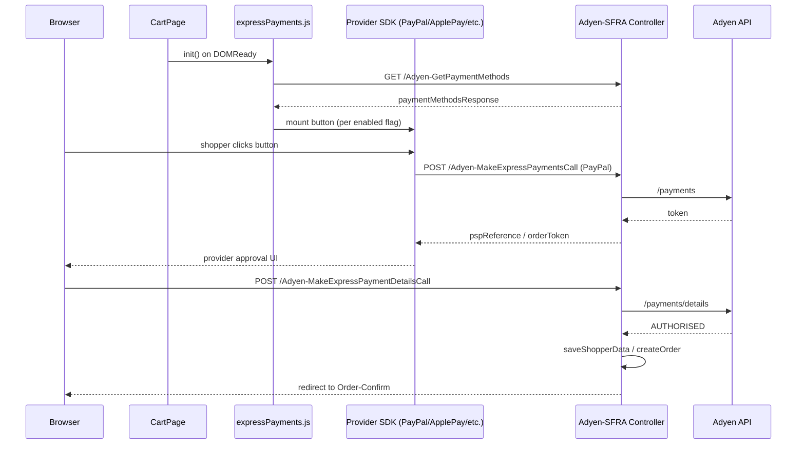

# TSD — Express Checkout (Adyen Multi-Method)

## 1. Context & problem

Baccarat shoppers need a faster path to purchase that bypasses the standard multi-step checkout for items already in their cart. The express checkout feature renders payment-provider-native buttons (PayPal, Apple Pay, Google Pay, Amazon Pay) on the cart page, letting a shopper authenticate, confirm shipping, and place an order entirely within the payment provider's native UI before returning to the confirmation page. All four methods are routed through the existing Adyen integration to avoid introducing a second payment gateway.

## 2. Goals & non-goals

**Goals**
- Render express payment buttons on the cart page, gated by per-method feature flags
- Complete the PayPal express flow server-side (basket → Adyen payments call → order creation → shopper data save)
- Support Apple Pay, Google Pay, and Amazon Pay express flows via Adyen components
- Preserve existing standard checkout flow unchanged

**Non-goals**
- Express buttons on the product detail page (separate scope)
- Express checkout for guest shoppers on mobile only (no restriction — available to all)
- Klarna express (redirect method, not supported in express mapping)
- Changing the payment processor from Adyen

## 3. Stakeholders

| Role | Name |
|---|---|
| Product owner | TBC |
| Tech lead | Bruno Lopes |
| QA | TBC |
| Client side | TBC |

## 4. Current state

The cart page renders a single "Proceed to Checkout" button in `cartridges/app_baccarat/cartridge/templates/default/cart/checkoutButtons.isml`. That button routes to `Checkout-Begin` with the `stage` param set to `shipping` (authenticated) or `customer` (guest). No shortcut payment paths exist today on the cart page.

The Adyen integration (`int_adyen_SFRA`, `app_adyen_SFRA`) already handles standard card and redirect payments (PayPal, Klarna) in the billing step of the standard checkout flow.

## 5. Proposed design

### 5.1 Architecture summary

The orchestrator `expressPayments.js` fires on cart page load, fetches the Adyen payment methods list once, then initialises each enabled provider module. Each module is self-contained and checks its own `window.is<Provider>ExpressEnabled` flag before mounting.

### 5.2 SFRA touchpoints

| Layer                    | File (cartridge-relative)                                                                      | Change                                                                                                                              |
| ------------------------ | ---------------------------------------------------------------------------------------------- | ----------------------------------------------------------------------------------------------------------------------------------- |
| Controller (Adyen)       | `app_baccarat/cartridge/controllers/Adyen.js`                                                  | Exposes `MakeExpressPaymentsCall`, `MakeExpressPaymentDetailsCall`, `SaveExpressShopperDetails`, `GetExpressShippingMethods` routes |
| Script — PayPal payments | `app_baccarat/cartridge/adyen/scripts/expressPayments/paypal/makeExpressPaymentsCall.js`       | Builds Adyen `/payments` request with PayPal line items; stores `paypalExpressOrderNo` in session                                   |
| Script — PayPal details  | `app_baccarat/cartridge/adyen/scripts/expressPayments/paypal/makeExpressPaymentDetailsCall.js` | Calls Adyen `/payments/details`; triggers order creation                                                                            |
| Script — shopper data    | `app_baccarat/cartridge/adyen/scripts/expressPayments/paypal/saveShopperData.js`               | Copies PayPal-provided address/name into basket                                                                                     |
| Script — shipping        | `app_baccarat/cartridge/adyen/scripts/expressPayments/shippingMethods.js`                      | Returns available shipping methods for express basket                                                                               |
| ISML — cart buttons      | `app_baccarat/cartridge/templates/default/cart/checkoutButtons.isml`                           | Adds CSRF token hidden input; express button containers injected by JS                                                              |
| Client JS — orchestrator | `app_baccarat/cartridge/client/default/js/expressPayments.js`                                  | Fetches payment methods; bootstraps per-provider modules                                                                            |
| Client JS — PayPal       | `app_baccarat/cartridge/client/default/js/paypalExpress.js`                                    | Adyen Web PayPal component; handles `onShopperDetails`, `onAuthorized`                                                              |
| Client JS — Apple Pay    | `app_baccarat/cartridge/client/default/js/applePayExpress.js`                                  | Adyen Web ApplePay component                                                                                                        |
| Client JS — Google Pay   | `app_baccarat/cartridge/client/default/js/googlePayExpress.js`                                 | Adyen Web GooglePay component                                                                                                       |
| Client JS — Amazon Pay   | `app_baccarat/cartridge/client/default/js/amazonPayExpressPart1.js`                            | Amazon Pay (two-part split due to SDK size)                                                                                         |
| Config — constants       | `app_baccarat/cartridge/adyen/config/constants.js`                                             | `EXPRESS_MAPPING: { paypal: "paypalExpress" }`; `REDIRECT_PAYMENTS` list                                                            |
| Utility — PayPal helper  | `app_baccarat/cartridge/adyen/utils/paypalHelper.js`                                           | Builds Adyen `lineItems` array from basket; formats shipping options                                                                |

### 5.3 Data model

No new system object attributes are required. The following **session privacy** attributes are used ephemerally during the express flow:

| Attribute | Type | Usage |
|---|---|---|
| `session.privacy.paypalExpressOrderNo` | String | Temporary order number created before Adyen `/payments` call; used to correlate the subsequent `/payments/details` call |
| `session.privacy.pspReference` | String | PSP reference returned by Adyen after initial authorisation |

Basket custom attributes (written by Adyen base cartridge):

| Attribute | Type | Usage |
|---|---|---|
| `basket.custom.adyenProductLineItems` | String (hashed) | Hash of product line items for anti-tampering check |

### 5.4 Integrations

| System | Direction | Protocol | Auth | Retry / circuit breaker |
|---|---|---|---|---|
| Adyen Checkout API (`/payments`) | Outbound | HTTPS/REST | API key via `AdyenService` LocalServiceRegistry profile | Handled by Adyen base cartridge service profile (3 retries, 5 s timeout) |
| Adyen Checkout API (`/payments/details`) | Outbound | HTTPS/REST | Same | Same |
| PayPal SDK (via Adyen Web Components) | Client-side | HTTPS | OAuth token issued by Adyen component | N/A — browser-side |
| Apple Pay JS API | Client-side | HTTPS | Merchant domain validation via Adyen | N/A |
| Google Pay API | Client-side | HTTPS | Merchant ID validated by Adyen | N/A |
| Amazon Pay SDK | Client-side | HTTPS | Amazon merchant credentials via Adyen | N/A |

### 5.5 Security

- Input validation: `req.form.data` (Adyen payment state) is passed opaque to the Adyen SDK; no direct basket mutation from this field
- Output encoding: ISML default encoding retained; no raw HTML injection in express templates
- CSRF: CSRF token is embedded in `checkoutButtons.isml` and submitted with each express controller call via the hidden `#adyen-token` input
- AuthN/AuthZ: Express routes are not login-gated (guest shoppers can use express checkout); shopper identity is asserted by the payment provider (PayPal email, Apple ID, etc.)
- PII handling: PayPal shopper data (name, address, email, phone) flows server-side only through `saveShopperData.js` into the basket; never logged per `AdyenLogs` conventions

### 5.6 Performance

- Caching: `GetPaymentMethods` response is not cached at the page level (called once per cart page load); Adyen base cartridge may apply its own response caching
- Expected request rate: One `GetPaymentMethods` call per cart page view; express payment calls only on shopper interaction — low frequency
- N+1 risks reviewed: `getLineItems()` in `paypalHelper.js` iterates basket product line items — O(n) on basket size, acceptable
- Pagination strategy: N/A

### 5.7 Accessibility

- WCAG 2.1 AA target
- Keyboard nav: Provider-native buttons (PayPal, Apple Pay, Google Pay) render their own keyboard-accessible components via Adyen Web Components
- Screen reader behavior: Provider buttons expose their own accessible labels; no additional ARIA needed from Baccarat side
- Color contrast: Provider buttons use provider-mandated brand colours; not overridable without violating provider brand guidelines

### 5.8 Observability

- Custom log file: `AdyenLogs.fatal_log` writes to the `AdyenFatal` custom log category (see `app_baccarat/cartridge/adyen/logs/adyenCustomLogs.js`)
- Log levels: `fatal_log` for unhandled exceptions in express payment scripts; `error_log` for expected payment failures
- Custom metrics / quotas: No custom quotas; Adyen API rate limits apply (configured in the `AdyenService` service profile)

## 6. Alternatives considered

| Option | Pros | Cons | Decision |
|---|---|---|---|
| Native PayPal SDK (bypass Adyen) | Direct PayPal control | Introduces second payment gateway; breaks unified reporting; double reconciliation | Rejected |
| Express buttons on PDP only | Less scope | Missed cart-level conversion opportunity | Rejected (both surfaces in scope; this TSD covers cart) |
| Single `Checkout-ExpressBegin` controller | Cleaner route namespace | Adyen base cartridge already owns the express routes; overriding is safer than replacing | Rejected — extend Adyen controller instead |

## 7. Rollout plan

- Feature flag / preference: Per-method site preferences (`isApplePayExpressEnabled`, `isPayPalExpressEnabled`, `isAmazonPayExpressEnabled`, `isGooglePayExpressEnabled`) rendered into `window.*` on the cart page; toggled in Business Manager → Site Preferences
- Phased rollout: Enable PayPal first (most complete implementation); Apple Pay + Google Pay second; Amazon Pay last (two-part SDK)
- Rollback strategy: Set the relevant site preference to `false` in Business Manager — buttons are hidden client-side immediately with no code deploy
- Code version & deployment window: Deploy with standard code version promotion; no DB migration required

## 8. Testing strategy

- Unit (mocha/chai/sinon): Unit tests for `makeExpressPaymentsCall.js` and `saveShopperData.js` mocking `BasketMgr`, `OrderMgr`, `Transaction`, and `adyenCheckout.doExpressPaymentsCall`
- Integration: End-to-end in Adyen test environment with PayPal sandbox credentials; verify basket → order flow produces a confirmed order
- Manual QA: Test each payment method with `isXxxExpressEnabled = true` on staging; verify button visibility toggling; verify order confirmation page reached; verify shopper address populated correctly
- Load: Not required for initial rollout; cart page load impact limited to one additional `GetPaymentMethods` XHR call

## 9. Open questions

- [ ] Which site(s) should have Apple Pay enabled at launch? (requires Apple Pay merchant domain registration per storefront URL)
- [ ] Is Amazon Pay required for all regions or only specific ones? (APAC, Middle East may have separate merchant accounts)
- [ ] Should the `paypalExpressOrderNo` session value be cleaned up if the shopper abandons the express flow mid-way?
- [ ] Do we need to handle the case where the express basket total changes (promo applied after button click) — should the Adyen token be invalidated?

## 10. Links

- PRs: TBC
- Jira / tickets: TBC
- Related TSDs: —
- Related ADRs: —
- Reference docs:
  - Adyen Web Components — Express Checkout: https://docs.adyen.com/payment-methods/paypal/web-component/
  - Adyen SFRA cartridge: `int_adyen_SFRA/README.md`
