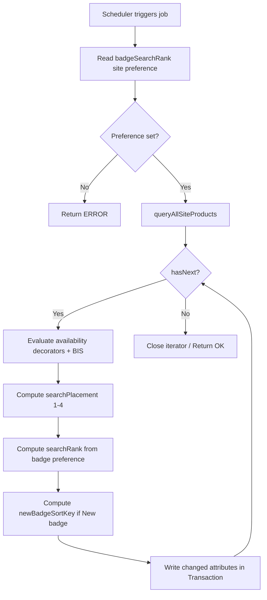

# TSD — Search Placement & Search Rank Job

---

## 1. Context & purpose

**Business goal.** To allow merchandising teams to effectively rank products in PLPs, a scheduled job computes and writes two SFCC sorting attributes — `searchPlacement` and `searchRank` — on every site product. `searchPlacement` reflects product availability (Add to Cart, Contact Us to Order, Out of Stock), while `searchRank` reflects the product's badge priority as configured by merchants. Together they feed the Sorting Rules defined in Business Manager, producing a deterministic and maintainable sort order without manual attribute management. The job also maintains two supporting attributes: `showInAvailableOnlineRefinement` (used for PLP "available online" filtering) and `newBadgeSortKey` (tie-breaker within the "New" badge group).

**Scope statement.**
- **In scope:** computing and persisting `searchPlacement`, `searchRank`, `showInAvailableOnlineRefinement`, and `newBadgeSortKey` on all site products; configuring the badge rank order via a site preference.
- **Out of scope:** Sorting Rule configuration in BM (manual step), search index rebuild triggers, front-end PLP rendering changes.

---

## 2. Goals & non-goals

**Goals**
- Assign `searchPlacement` 1–4 based on product availability / PDP CTA.
- Assign `searchRank` based on the badge priority defined in the `badgeSearchRank` site preference.
- Assign `newBadgeSortKey` to "New" badge products to break ties within that badge group.
- Keep `showInAvailableOnlineRefinement` in sync with actual in-stock / purchasable status.
- Ensure re-runs are idempotent — only write when a value actually changes.

**Non-goals**
- Automatic Sorting Rule configuration in BM.
- Real-time / event-driven updates (job is scheduled, not triggered per product save).

---

## 3. Stakeholders

| Role | Name | Notes |
|---|---|---|
| Product owner | TBD | |
| Tech lead | Bruno Lopes | |
| QA lead | TBD | |
| Client side | TBD | |
| Other | Merchandising team | Owns `badgeSearchRank` preference configuration |

---

## 4. Current state

Prior to this feature, `searchPlacement` and `searchRank` were not systematically maintained. Sorting rules in BM could not rely on these attributes for badge-based or availability-based ordering. The `showInAvailableOnlineRefinement` attribute and `newBadgeSortKey` did not exist.

---

## 5. Proposed design

### 5.1 Architecture summary

A single `ExecuteScriptModule` job step iterates all site products via `ProductMgr.queryAllSiteProducts()`, evaluates each product's availability and badge, and writes up to four attributes per product inside a `Transaction.wrap`. Sorting Rules in BM are then configured to sort ascending on `searchPlacement`, then ascending on `searchRank`, then descending on ATS as a final tie-breaker.



### 5.2 Cartridge impact

| Cartridge | Status | Notes |
|---|---|---|
| `app_Baccarat_storefront` | modified | new job script added |

- Cartridge path order changes: none
- Multi-site / locale scope: job runs per site; `badgeSearchRank` is a site preference scoped per site
- Frontend stack: SFRA

### 5.3 SFRA touchpoints

| Layer | File (cartridge-relative) | Change |
|---|---|---|
| Job | `cartridges/app_Baccarat_storefront/cartridge/scripts/jobs/UpdateSearchPlacementAndRank.js` | new |

### 5.4 Data model

#### System object extensions

| Object | Attribute ID | Type | Localizable | Searchable | Mandatory | Default |
|---|---|---|---|---|---|---|
| Product | `searchPlacement` | Integer | No | Yes | No | — |
| Product | `searchRank` | Integer | No | Yes | No | — |
| Product | `custom.showInAvailableOnlineRefinement` | Boolean | No | Yes | No | false |
| Product | `custom.newBadgeSortKey` | Integer | No | Yes | No | null |

#### Custom objects

N/A — not applicable to this change.

#### Site preferences

| ID | Type | Default | BM visibility group | Notes |
|---|---|---|---|---|
| `badgeSearchRank` | String (JSON) | — | Storefront Configurations | JSON array of `{ badge, rank }` objects defining badge priority order |

**`badgeSearchRank` example value:**
```json
{
    "badges": [
        { "badge": "NewPreOrder",                "rank": 1 },
        { "badge": "OnlineExclusivePreOrder",    "rank": 2 },
        { "badge": "PreOrder",                   "rank": 3 },
        { "badge": "New",                        "rank": 4 },
        { "badge": "BestSeller",                 "rank": 5 },
        { "badge": "LimitedEdition",             "rank": 6 },
        { "badge": "LimitedNumberedEdition",     "rank": 7 },
        { "badge": "NumberedEdition",            "rank": 8 },
        { "badge": "OnlineExclusive",            "rank": 9 }
    ]
}
```

**Path in BM:** Merchant Tools > Site Preferences > Custom Site Preference Groups > Storefront Configurations > Badge Search Rank

**Migration / backfill.** First job execution populates all attributes. No separate migration script required.

### 5.5 Service & integration design

N/A — not applicable to this change. No external service calls.

### 5.6 OCAPI / SCAPI hooks

N/A — not applicable to this change.

### 5.7 Jobs & schedules

| Field | Value |
|---|---|
| Job ID | `UpdateSearchPlacementAndRank` |
| Description | Computes and writes searchPlacement, searchRank, showInAvailableOnlineRefinement, and newBadgeSortKey on all site products |
| Step type | `ExecuteScriptModule` |
| Script path | `app_Baccarat_storefront/cartridge/scripts/jobs/UpdateSearchPlacementAndRank.js` |
| Exported function | `updateSearchPlacementAndRank(params)` |
| Chunk-oriented? | No |
| Schedule (cron) | TBD — configured in Staging and Production; Administration > Operations > Jobs |
| Parameters | `LogLevel : String = INFO` (set to `DEBUG` for verbose per-product logging) |
| Idempotency | Yes — attributes are only written when the computed value differs from the current value |

### 5.8 Business Manager configuration

- Job registered at: Administration > Operations > Jobs
- Site preference configured at: Merchant Tools > Site Preferences > Custom Site Preference Groups > Storefront Configurations > `badgeSearchRank`
- Sorting Rules configured at: Merchant Tools > Search > Sorting Rules
  - Sort 1: `searchPlacement` ascending
  - Sort 2: `searchRank` ascending
  - Sort 3: ATS descending (tie-breaker by inventory level)

### 5.9 Security

| Concern | Detail |
|---|---|
| Input validation | `badgeSearchRank` preference is parsed with `JSON.parse`; job returns `Status.ERROR` if null or unparseable |
| Output encoding | N/A — no ISML rendering |
| CSRF | N/A — job context, no HTTP request |
| Authentication | Job runs in trusted server context |
| Authorization | Job access controlled via BM role permissions |
| Sensitive data | No PII or PCI data handled |
| Dependency security | No new npm packages introduced |

### 5.10 Performance & caching

- Job iterates all site products with `ProductMgr.queryAllSiteProducts()` — one DB transaction per product that has changed values. Products with no attribute changes are skipped to minimise write volume.
- ⚠️ For large catalogs, execution time scales linearly with product count. Monitor job duration; consider chunk-oriented refactor if timeout issues arise.
- Each product evaluation calls `BisHelper.getProductInfo(product.ID)` — verify this method is not making a remote call per product in production.
- No search index rebuild is triggered by the job itself; a separate re-indexing step may be needed after job completion for changes to be reflected in search results.
- N+1 risks reviewed: `BisHelper.getProductInfo` per product is a potential concern — TBD whether it hits cache or DB.

### 5.11 Accessibility (WCAG 2.1 AA)

N/A — not applicable to this change. Server-side job, no UI output.

### 5.12 Observability

- Logger category: default SFCC logger via `dw/system/Logger`
- Log levels in use:
  - `ERROR`: missing `badgeSearchRank` preference; empty product query result
  - `INFO` (when `LogLevel=DEBUG`): per-product badge list, and each attribute change (`searchRank`, `searchPlacement`, `newBadgeSortKey`)
- Job execution status visible in BM under Administration > Operations > Jobs > job history

---

## 6. Alternatives considered

| Option | Pros | Cons | Decision |
|---|---|---|---|
| Real-time hook on product save | Immediate consistency | Hook overhead on every product write; complex error handling | Rejected — batch job sufficient for merchandising cadence |
| Hardcoded badge priority in code | Simple | Requires code deploy for each badge reorder | Rejected — site preference allows merchant self-service |

---

## 7. Risks & assumptions

| ⚠️ Risk | Impact | Mitigation |
|---|---|---|
| ⚠️ `badgeSearchRank` preference misconfigured or missing | Job exits with ERROR; no attributes updated | Validate JSON format in BM before activating job; add monitoring alert |
| ⚠️ Large catalog causes job timeout | Attributes not fully updated | Monitor job duration; consider chunk-oriented refactor |
| ⚠️ `BisHelper.getProductInfo` issues for high product count | Slow job execution or errors | Profile BIS helper; confirm caching behaviour |
| ⚠️ Search index not rebuilt after job | Sort order not reflected in storefront | Ensure re-index job runs after `UpdateSearchPlacementAndRank` in the job chain |

**Assumptions.**
- `product.custom.badge` is a multi-value enum attribute; `.value` on each entry returns the string badge ID.
- The `newBadgeSortKey` is derived from `parseInt(product.ID.replace(/\D/g, ""), 10)`. Product IDs are expected to contain numeric substrings meaningful for ordering within the "New" badge group.
- BM Sorting Rules are configured manually post-deployment.

---

## 8. Testing strategy

- **Unit (mocha/chai/sinon):** mock `ProductMgr`, `Site`, `BisHelper`, and decorators; assert correct `searchPlacement` and `searchRank` values for each availability / badge scenario; assert `newBadgeSortKey` is set only for "New" badge products.
- **Integration:** run job against a sandbox with known product fixtures covering all four placement scenarios and all badge types; verify attribute values in BM product editor.
- **Manual QA checklist:**
  - [ ] Products with "Add to Cart" CTA have `searchPlacement = 1`
  - [ ] Products with "Contact Us to Order" CTA have `searchPlacement = 2`
  - [ ] Out-of-stock BIS products have `searchPlacement = 3`
  - [ ] `searchRank` matches badge order in `badgeSearchRank` preference
  - [ ] "New" badge products have `newBadgeSortKey` set to numeric portion of product ID
  - [ ] Non-"New" badge products have `newBadgeSortKey = null`
  - [ ] `showInAvailableOnlineRefinement = true` only for in-stock purchasable products
  - [ ] Job completes with `Status.OK`; `Status.ERROR` returned when preference is missing
- **Regression risk areas:** PLP sort order; "Available Online" refinement filter; BIS-enabled product display
- **Load testing:** recommended for catalogs > 10,000 products to validate job duration within scheduler timeout.

---

## 9. Deployment & rollback

**Deployment order.**
1. Metadata upload — system object attribute extensions (`showInAvailableOnlineRefinement`, `newBadgeSortKey`), site preference (`badgeSearchRank`)
2. Code version activation
3. Configure `badgeSearchRank` site preference value in BM
4. Run `UpdateSearchPlacementAndRank` job manually to populate attributes
5. Configure / activate Sorting Rules in BM
6. Trigger search re-index

- **Feature flag / dark-launch toggle:** none — Sorting Rules in BM can be left inactive until attributes are validated
- **Rollback procedure:** deactivate Sorting Rule in BM; revert code version; no data model cleanup required (attributes remain but are unused)
- **Post-deployment smoke tests:** verify PLP sort order reflects expected badge and availability ordering on Staging before Production promotion

---

## 10. Open questions

- [ ] What is the correct cron schedule for Staging and Production?
- [ ] Does `BisHelper.getProductInfo` cache results or hit the DB per call? Confirm with BIS integration owner.
- [ ] Should `newBadgeSortKey` ordering be ascending or descending in the Sorting Rule? (Lower product ID number first, or higher?)
- [ ] Is a search re-index job already chained after this job in the scheduler, or does it need to be added?

---

## 11. Links

- **PRs:** TBD
- **Tickets:** TBD
- **Related TSDs:** none
- **Related ADRs:** none
- **Reference docs:** BM > Merchant Tools > Search > Sorting Rules; BM > Administration > Operations > Jobs

---

## Quality checklist

- [ ] All 11 sections present (or explicitly marked **N/A**)
- [ ] All service IDs, hook IDs, custom-object names match the code
- [ ] Security section addresses all 7 concerns
- [ ] No OCAPI hooks left un-flagged for potential SCAPI / Custom API migration
- [ ] Multi-site / locale scope is clearly stated
- [ ] Deployment order is explicit and reversible
- [ ] Cartridge-relative paths used (no absolute paths)
- [ ] No invented details — unknowns marked "TBD — requires confirmation from <role>"
- [ ] Frontmatter complete: `client`, `date`, `status`, `tags`, `related-prs` or `related-tickets`
- [ ] ⚠️ risks identified or explicitly stated as "none"
- [ ] 🔴 DEPRECATED patterns flagged with rationale and migration path
