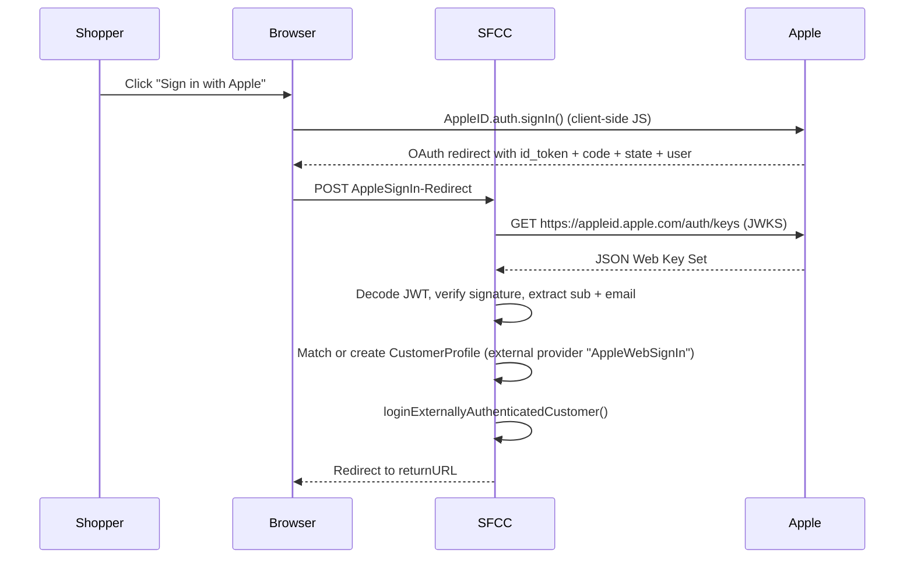

# TSD — Apple Sign In (int_apple_signin)

## 1. Context & problem

MyO requires a social login option via Apple ID to reduce friction at login and checkout for customers using Apple devices. The integration uses Apple's OAuth 2.0 / OpenID Connect flow: the storefront redirects to Apple, receives an `id_token` JWT plus optional user metadata, verifies the JWT signature against Apple's JWKS, and either creates or merges a customer account before logging the user in. The feature is delivered as a standalone cartridge (`int_apple_signin`) that extends `mo_storefront` controllers non-invasively.

**MES-1233 — Carrier tracking email problem (private relay):** A recurring customer service escalation has surfaced around Apple Sign-in users who chose the "Hide My Email" option. Apple replaces the real email with a `@privaterelay.appleid.com` relay address, which only forwards emails from sender domains the merchant has validated in the Apple Developer Console via DNS ownership. Carrier tracking emails (Chronopost, etc.) originate from carrier-owned domains we cannot validate, so Apple silently drops them and customers receive no delivery notifications.

Attempting to detect private-relay addresses at runtime is unreliable — an address may appear standard but still be a relay. The resolution is to request a verified real email from **all** Apple Sign-in users at the delivery step of checkout, persist it on the address for home delivery, and propagate it to the order import payload so carriers always have a genuinely reachable address.

## 2. Goals & non-goals

**Goals**
- Allow shoppers to authenticate with their Apple ID on the login page and guest checkout
- Verify Apple JWTs on the server side using Apple's public JWKS endpoint
- Link or create SFCC customer accounts based on the verified email/sub claims
- Handle Apple's private-relay masked emails (`@privaterelay.appleid.com`) without blocking login
- Guard against CSRF via a per-request state token stored in session privacy cache
- Guard against open-redirect attacks on the post-login return URL
- _(MES-1233)_ Display a mandatory real-email field at the checkout delivery step for all Apple Sign-in users (private-relay detection at runtime is not reliable)
- _(MES-1233)_ For home delivery: persist the collected email on the `CustomerAddress` object so it pre-fills on reuse and is editable
- _(MES-1233)_ For relay point delivery: require an email field per-order in the relay form (no persistence — relay points are not saved)
- _(MES-1233)_ Block progression to payment until a valid email has been entered and format-validated
- _(MES-1233)_ Propagate the collected email to the order import payload so carriers receive a deliverable address; it takes precedence over the Apple relay email

**Non-goals**
- Server-to-server token exchange (authorization code is received but not used)
- Mobile native Sign In with Apple (iOS SDK flow) — this covers web only
- Unlinking an Apple account from an existing profile
- Handling revoked Apple tokens or account deletion webhooks
- _(MES-1233)_ Whitelisting carrier sender domains in the Apple Developer Console (DNS ownership not feasible for third-party carrier domains)
- _(MES-1233)_ Detecting private-relay emails via format heuristics (unreliable — field is shown to all Apple Sign-in users)
- _(MES-1233)_ Persisting the email entered for a relay point order (relay point addresses are per-order, not saved)

## 3. Stakeholders

| Role | Name |
|---|---|
| Product owner | MyO client |
| Tech lead | Bruno Lopes |
| QA | TBD |
| Client side | TBD |

## 4. Current state

The `int_apple_signin` cartridge is already implemented and sits first in the cartridge path:

```
int_apple_signin:int_bazaarvoice:mo_storefront:mo_core:int_gtm:int_citrusAd:...
```

The feature is toggled by the `isAppleSignInEnabled` site preference (boolean, default `false`). All pages that can render the Apple button check this flag before rendering.

Existing touchpoints:
- `int_apple_signin/cartridge/controllers/Login.js` — appends to `Login-Show`
- `int_apple_signin/cartridge/controllers/Checkout.js` — appends to `Checkout-Begin`
- `int_apple_signin/cartridge/controllers/AppleSignIn.js` — owns the `AppleSignIn-Redirect` POST endpoint
- `int_apple_signin/cartridge/scripts/helpers/appleHelpers.js` — JWT verification + redirect validation
- `int_apple_signin/cartridge/scripts/services/appleJWKS.js` — JWKS HTTP service
- `int_apple_signin/cartridge/templates/default/account/components/appleSignInButton.isml` — device-aware button
- `int_apple_signin/cartridge/templates/default/account/components/oauth.isml` — OAuth form (Google / Facebook / Apple)

Custom profile attributes added via `migrations/MES-793/meta/system-objecttype-extensions.xml`:
- `Profile.isSocialLogin` (boolean)
- `Profile.socialLoginType` (string)
- `Profile.wasMerged` (boolean)

## 5. Proposed design

### 5.1 Architecture summary



The flow is entirely server-side after the initial Apple redirect; no access token is stored, only the verified claims.

### 5.2 SFRA touchpoints

| Layer | File (cartridge-relative) | Change |
|---|---|---|
| Controller | `int_apple_signin/cartridge/controllers/Login.js` | Appends to `Login-Show`; adds `appleSignIn` object to view model |
| Controller | `int_apple_signin/cartridge/controllers/Checkout.js` | Appends to `Checkout-Begin`; adds `appleSignIn` object to view model |
| Controller | `int_apple_signin/cartridge/controllers/AppleSignIn.js` | New — owns `AppleSignIn-Redirect` POST route |
| Helper | `int_apple_signin/cartridge/scripts/helpers/appleHelpers.js` | New — JWT decode/verify, redirect URL validation |
| Service | `int_apple_signin/cartridge/scripts/services/appleJWKS.js` | New — JWKS HTTP GET, parses key set |
| ISML | `int_apple_signin/cartridge/templates/default/account/components/appleSignInButton.isml` | New — device-aware button (iPhone/iPad/Safari on Mac only) |
| ISML | `int_apple_signin/cartridge/templates/default/account/components/oauth.isml` | New — OAuth form (Google + Facebook + Apple) |
| Resources | `int_apple_signin/cartridge/templates/resources/login.properties` | New — error message string for Apple sign-in failure |

### 5.3 Data model

**Profile system object extensions** (`migrations/MES-793`):

| Attribute | Type | Mandatory | Default | BM-visible | Notes |
|---|---|---|---|---|---|
| `isSocialLogin` | Boolean | No | false | Yes | Set to `true` after any social login |
| `socialLoginType` | String | No | — | Yes | `"Apple"`, `"Google"`, or `"Facebook"` |
| `wasMerged` | Boolean | No | false | Yes | `true` when an existing account was linked to the external profile |

**SitePreferences extensions** (`migrations/MES-793`):

| Preference | Type | Default | Notes |
|---|---|---|---|
| `isAppleSignInEnabled` | Boolean | `false` | Master on/off toggle |
| `appleSignInClientId` | String | — | Apple Services ID (e.g. `com.myorigines.store`) |
| `appleSignInJSURL` | String | Apple CDN URL with `{locale}` placeholder | Client-side JS library URL |
| `appleSignInJWTIssuerId` | String | `https://appleid.apple.com` | JWT `iss` claim expected value |
| `appleSignInRequestScopes` | String | `"name email"` | Space-separated OAuth scopes |

### 5.4 Integrations

| System | Direction | Protocol | Auth | Retry / circuit breaker |
|---|---|---|---|---|
| Apple JWKS endpoint (`https://appleid.apple.com/auth/keys`) | Outbound | HTTPS GET | None (public endpoint) | No retry, no circuit breaker — failure returns error to shopper |
| Apple JS SDK (`https://appleid.cdn-apple.com/…/appleid.auth.js`) | Inbound CDN | HTTPS | None | Client-side, browser handles |

### 5.5 Security

- **Input validation:** `state` param validated against session value before any processing; mismatches abort with error. Redirect URL validated via `validateRedirectUrl()` — protocol-relative URLs rejected, host must match storefront origin.
- **Output encoding:** ISML default encoding retained; no raw output in templates.
- **CSRF:** Per-request UUID state token generated in controller, stored in `req.session.privacyCache`, matched on POST redirect.
- **AuthN/AuthZ:** JWT verified against Apple's JWKS (signature + `iss` + `aud` claims). `loginExternallyAuthenticatedCustomer()` used — no password involved.
- **PII handling:** Email may be a private Apple relay address (`@privaterelay.appleid.com`). Neither the `id_token` nor the `code` is persisted; only verified claims (email, name) are written to the customer profile. `firstName`/`lastName` arrive only on the first sign-in and are accepted at face value.

### 5.6 Performance

- **Caching:** No page-level caching on `AppleSignIn-Redirect` (POST, inherently uncacheable). Apple JS CDN is edge-cached by Apple.
- **Expected request rate:** Social login is low-volume; JWKS call adds one round-trip per login — Apple's JWKS changes infrequently, so a short-lived custom cache on the key set could be introduced in a follow-up if needed.
- **N+1 risks:** None. Single JWKS call + single customer lookup per login.
- **Pagination:** N/A.

### 5.7 Accessibility

- **WCAG 2.1 AA target**
- **Keyboard nav:** Apple's JS SDK renders its own button with built-in focus management; custom ISML button uses `<button>` element.
- **Screen reader behavior:** Button label provided via Apple SDK attributes and ISML `aria-label`.
- **Color contrast:** Apple-branded button uses Apple's official dark/light variants (white text on black); meets AA.
- **Device visibility:** Button is shown only on iPhone, iPad, and Safari on Mac per Apple's guidelines — no ARIA hide required for other devices.

### 5.8 Observability

- **Custom log file:** `apple_web_sigin` (note: typo in service log prefix; matches existing service config)
- **Log levels:** Errors logged at `ERROR` in `appleJWKS.js` (connection errors, parse failures, service unavailability) and in `AppleSignIn.js` (JWT verification failures, state mismatch, disabled customer)
- **Custom metrics / quotas:** None currently. Consider monitoring JWKS service error rate in BM Communication Logs.

## 6. Alternatives considered

| Option | Pros | Cons | Decision |
|---|---|---|---|
| Server-side authorization code exchange (backend token exchange with Apple) | More secure, allows token refresh | Requires Apple private key on server, significantly more complex | Rejected — implicit flow sufficient for web login; no refresh needed |
| Using OCAPI external auth hook | Consistent with OCAPI patterns | OCAPI is being deprecated; adds complexity vs. controller extension | Rejected — controller extension chosen |
| Caching the JWKS response | Reduces Apple API dependency per request | Apple rotates keys; stale key risks verification failure | Deferred — acceptable for current volume; revisit at scale |

## 7. Rollout plan

- **Feature flag / preference:** `isAppleSignInEnabled` site preference — can be toggled per site in BM without code deployment.
- **Phased rollout:** Enable on staging first, validate JWT flow end-to-end, then enable on production.
- **Rollback strategy:** Set `isAppleSignInEnabled = false` in BM; button disappears from all pages immediately. No data migration needed to roll back.
- **Code version & deployment window:** Cartridge deployed as part of standard code version deployment. Migration `MES-793` must run before enabling the preference.

## 8. Testing strategy

- **Unit (mocha/chai/sinon):** Test `appleHelpers.js` — JWT decode, signature verification logic, redirect URL validation. Mock JWKS response.
- **Integration:** End-to-end test with Apple sandbox credentials on dev sandbox: new account creation, account merge, masked email path.
- **Manual QA:** Test on iPhone (Safari), iPad (Safari), Mac (Safari) — button must appear. Test on Chrome/Windows — button must not appear. Test CSRF: tamper state param, verify rejection.
- **Load:** N/A — social login volume is low.

## 9. Open questions

- [ ] What is the Apple Services ID (`appleSignInClientId`) configured in Apple Developer portal for production? Confirm domain verification file is deployed.
- [ ] Should masked-email accounts be mergeable later if the shopper reveals their real email? Current implementation creates a separate account.
- [ ] Does MyO want to support "Sign in with Apple" on the Account page (re-linking) or only at login/checkout?
- [ ] JWKS caching: implement a short-lived custom cache (e.g. 1 hour) to reduce dependency on Apple's JWKS endpoint availability?
- [ ] _(MES-1233)_ Proposed field wording needs content team sign-off: "To receive parcel tracking notifications from our carrier, please provide a valid email address." (new address form) and "Required information to continue your purchase: please provide a valid email address for your delivery tracking." (existing address without email).
- [ ] _(MES-1233)_ Which `CustomerAddress` custom attribute name should store the carrier email? Needs to be agreed before metadata migration is written.
- [ ] _(MES-1233)_ Confirm with the back-end/ERP team which field name in the order import payload should carry the carrier email, and what happens if it is absent (fallback to profile email?).
- [ ] _(MES-1233)_ Does the relay point email field need to be shown for both `int_mondialrelay` and `int_shop2shop`, or only one? Confirm which relay point integration is in scope.

## 10. Links

- PRs: 
- Jira / tickets:
  - [MES-793](https://myorigines.atlassian.net/browse/MES-793) — base Apple Sign-in implementation
  - [MES-1233](https://myorigines.atlassian.net/browse/MES-1233) — Mandatory Email Input Request at Checkout for Apple Sign-in Users (Private Relay) — _last synced 2026-05-22_
- Related TSDs: 
- Related ADRs: 
- Reference docs:
  - [Sign in with Apple — Apple Developer](https://developer.apple.com/sign-in-with-apple/)
  - [Apple ID OAuth 2.0 — OpenID Connect](https://appleid.apple.com/.well-known/openid-configuration)
  - [plugin_jwt cartridge](../../../repo/cartridges/plugin_jwt)
